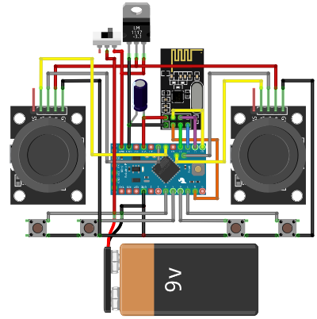
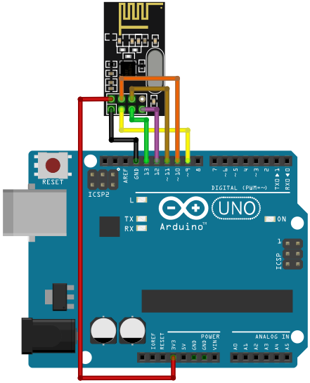

# Arduino-nRF24L01-Controller
Репозиторій з програмним забезпеченням для маніпулятора на базі Arduino. Передача даних реалізована за допомогою модуля nRF24L01. Для роботи в Arduino IDE, необхідно встановити бібліотеку [_RF24_](https://github.com/maniacbug/RF24).

Даний код містить наступні параметри:
- _DZ_ — мертва зона джойстиків, у межах якої вихідні дані про їх стани не змінюються (за замовчуванням – 20).
- _LX, LY_ — положення джойстика 1 (вісь X та Y).
- _RX, RY_ — положення джойстика 2 (вісь X та Y).
- _BTN1, BTN2, BTN3, BTN4_ — стани кнопок.
- _uint16_t data[8]_ — цілочисельний масив всіх даних, що передаються.

В таблиці нижче наведено перелік портів Arduino та підключені до них елементи:
|Порт|Підключений елемент|
|-|-|
|4|Кнопка 1|
|5|Кнопка 2|
|6|Кнопка 3|
|7|Кнопка 4|
|A2|Джойстик 1 (X)|
|A1|Джойстик 1 (Y)|
|A6|Джойстик 2 (X)|
|A7|Джойстик 2 (Y)|

Для забезпечення зв'язку між Arduino та nRF24L01 використовується інтерфейс SPI. Щоб налаштувати зв'язок між ними, необхідно підключити певні піни до відповідних портів Arduino Pro Mini, які призначені для SPI. Нижче наведено список портів для SPI, що використовуються в Arduino Pro Mini:
|Пін|Порт|Опис|
|-|-|-|
|CE|8|Пін вибору каналу nRF24L01|
|CSN|10|Пін вибору пристрою SPI|
|MOSI|11|Пін передачі даних від мікроконтролера до пристрою SPI|
|MISO|12|Пін передачі даних від пристрою SPI до мікроконтролера|
|SCK|13|Пін генерації тактового сигналу для SPI|

# Схеми підключення

  

Схема підключення контролера

  

Схема підключення приймача

